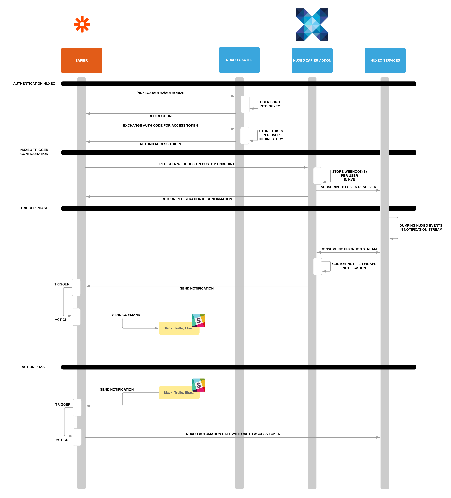

# Nuxeo Zapier Integration

This repository contains:

- The required Nuxeo platform add-on to make it work with Zapier. (10.10 Nuxeo Platform or higher)
- The Nuxeo Zapier app with auths, triggers and actions.



## Zapier Nuxeo Webhook

The add-on requires 10.10 Nuxeo Platform or higher.

The add-on once add a OAuth 2 Nuxeo provider:

- Zapier will connect through it for authentication
- You will need to setup the custom secret (go to Admin Center > Cloud Services)

The add-on contains the technical layer to interact with Zapier:

- It subscribes to Nuxeo Notifications and receives commands via Nuxeo Automation operations.

- It installs the required webhook to expose the appropriate REST API for Zapier.
- A custom resolver and notifier to extend the Nuxeo notification service.

#### Custom Notification extensions

In order to add new resolvers to the Nuxeo platform and get them available on Zapier, please follow the [Notification service documentation](WIP).

#### Custom Automation Operations

In order to add new operations to the Nuxeo platform and get them available on Zapier, please follow the [Automation service documentation](https://doc.nuxeo.com/nxdoc/contributing-an-operation/).

## Zapier App

The Zapier app has been written to be deployed on the Zapier infrastructure thanks to the [Zapier CLI](https://zapier.com/developer/documentation/v2/getting-started-cli/) and [Zapier Script](https://zapier.com/developer/documentation/v2/scripting/).

### The structure

```
├── README.md
├── auth
│   ├── basic.js
│   └── oauth.js
├── creates - "the actions"
│   └── automationOperation.js - "generic action to use any Nuxeo Automation operations"
│   └── documentAttach.js - "action to attach binary on a given document"
│   └── documentCreation.js - "action to create a document in a given location"
│   └── documentUpdate.js - "action to update a given document"
│   └── fileImporter.js - "action to import a document in a given location"
│   └── startWorkflow.js - "action to start a worflow on given document(s)"
├── index.js
├── package.json
├── test
│   ├── AuditHook.js
│   └── oauth.js
|   ....
└── triggers
    ├── WebHook.js - "the generic trigger via hook for all Nuxeo notifications/resolvers"
    ├── WebHookFile.js - "trigger when a document is created"
```

## Building

```bash
mvn clean install
```

## Contribute

Don't hesitate to post issues/questions/needs and suggest pull requests.

## License

[Apache License, Version 2.0](http://www.apache.org/licenses/LICENSE-2.0.html) 

(C) Copyright Nuxeo Corp. (http://nuxeo.com/)

All images, icons, fonts, and videos contained in this folder are copyrighted by Nuxeo, all rights reserved.

## About Nuxeo

Nuxeo dramatically improves how content-based applications are built, managed and deployed, making customers more agile, innovative and successful. Nuxeo provides a next generation, enterprise ready platform for building traditional and cutting-edge content oriented applications. Combining a powerful application development environment with SaaS-based tools and a modular architecture, the Nuxeo Platform and Products provide clear business value to some of the most recognizable brands including Verizon, Electronic Arts, Sharp, FICO, the U.S. Navy, and Boeing. Nuxeo is headquartered in New York and Paris. More information is available at www.nuxeo.com.